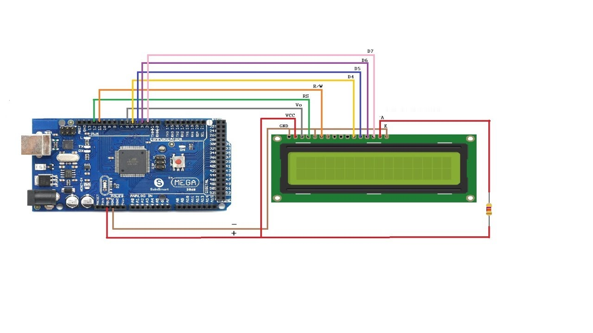

## 📲 LCD-Writer-Mod-Minecraft
This mod allows its users to write text into an LCD using MCreator Link and Arduino. Download the files and run the .ino file for the Arduino, and then run the provided .jar files in Minecraft. This mod is open source meaning that everyone can amend and contribute to the project.

---

## 📖 Steps to use the mod
Follow these steps to use the mod:
1. Download the ZIP file below.
2. Extract the ZIP file using any tools.
3. Run the INO file provided, make sure to have your Arduino connected!
4. Copy the two JAR files provided into your mods folder in Minecraft.
5. Download NeoForge 1.21.4-137.
6. Boot up Minecraft.
7. Click L, then wait for your Arduino to appear.
8. Click on your Arduino on the MCreator Link page then click connect.
9. Load into a Minecraft world.
10. Using the provided /lcdwrite command or the LCD Writer Block, write text in it, and make sure the text is below 20 characters long!

---

## 🧠 Features

* "/lcdwrite" command to write into the LCD without the block.
* An LCD Writer Block to write into the LCD with an interface.

---

## 🧪 How It Works

1. The code formats the text provided in the block or the command into "Line-1|Line-2|Line-3|Line-4".
2. It adds "/n" at the end to differentiate the text from other texts in the serial.
3. The Arduino IDE reads from the serial.
4. It copies the formatted text from the serial and removes the "|".
5. It filters out the "/n".
6. It then sends it to the LCD with msg? at the front to confirm it's working.
7. The LCD resets, then displays the text.

---

## 🧰 Parts List

| Part                 | Notes                                         |
| -------------------- | --------------------------------------------- |
| Arduino (any flavor) | The brain of the operation.                   |
| I2C LCD              | The screen used in the project.               |
| F-M Jumper Wires     | For the connections.                          |

---

## 🗺️ Wiring Diagram

Follow this diagram for the Liquid Crystal Display with the I2C backpack on.

Follow this diagram for the Liquid Crystal Display WITHOUT the I2C backpack on.

---

## 📦 Dependencies

* `MCreatorLink.h`
* `LiquidCrystal_I2C.h (for Liquid Display Crystals with the I2C backpack)`
* `LiquidCrystal.h (for Liquid Display Crystals without the I2C backpack)`
* `hd44780 (for Liquid Display Crystals without the I2C backpack and newer Arduinos)`

---

## ‼️Liquid Display Crystal without the I2C backpack

I will publish the code soon for the Liquid Display Crystal without the I2C backpack but in the meanwhile, try to ask ChatGPT or any other Artificial Intelligence model for assistance for the code, and if you have the capability to code it yourself, you can code it and pass the code to me. I will have to check the mod for any problems first before I can move on to making the Liquid Display Crystal without the I2C backpack version of the INO file.

---

## 📜 Licensure

Do whatever you want with it. Attribute me if you want. Just don't use it in a way that violates the law.
